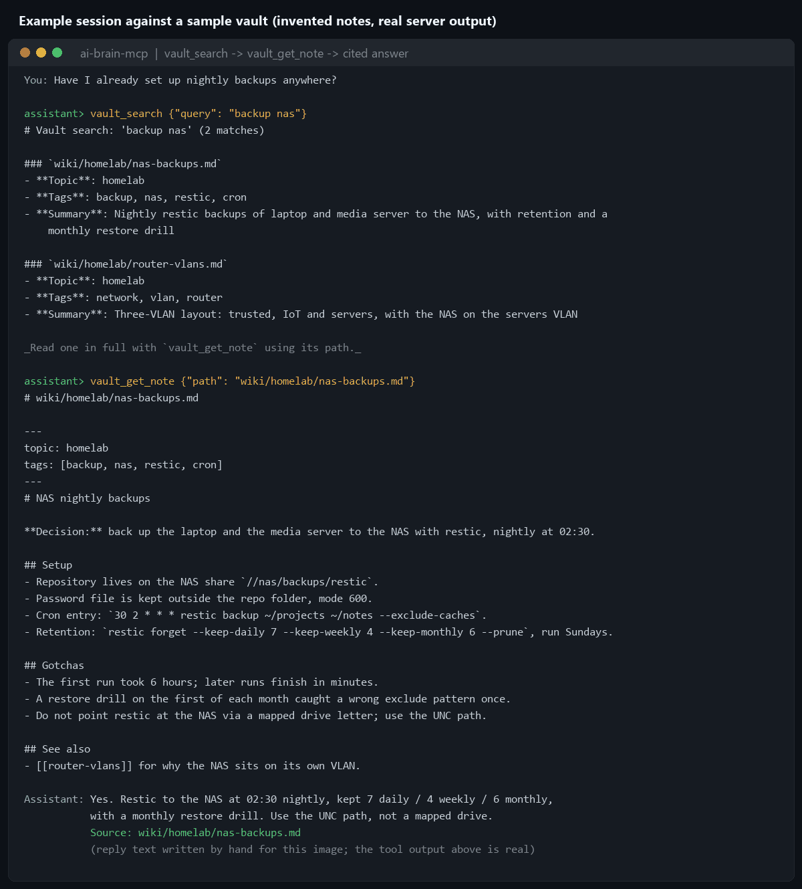
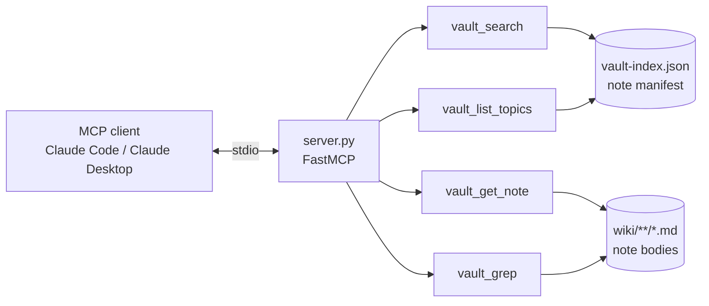

# ai-brain-mcp

Give an AI assistant read-only search over your Obsidian vault, so it answers "have I solved this
before?" from your own notes and cites the note it used.

[](https://github.com/darkspaz-v1/ai-brain-mcp/actions/workflows/ci.yml)
[](LICENSE)

[Quick start](#quick-start) · [Tools](#tools) · [How it works](#how-it-works) · [Proof](#proof) · [Known limitations](#known-limitations)

One real call and its actual response, against the synthetic vault in
[`examples/sample-vault`](examples/sample-vault) (full capture in
[`docs/media/demo-capture.txt`](docs/media/demo-capture.txt)):

```
> vault_search {"query": "backup nas", "limit": 3}

# Vault search: 'backup nas' (2 matches)

### `wiki/homelab/nas-backups.md`
- **Topic**: homelab
- **Tags**: backup, nas, restic, cron
- **Summary**: Nightly restic backups of laptop and media server to the NAS,
  with retention and a monthly restore drill

### `wiki/homelab/router-vlans.md`
- **Topic**: homelab
- **Tags**: network, vlan, router
- **Summary**: Three-VLAN layout: trusted, IoT and servers, with the NAS on
  the servers VLAN

_Read one in full with `vault_get_note` using its path._
```



*Example session against a sample vault (invented notes in [`examples/sample-vault`](examples/sample-vault)).
The tool output above and in the image is real, captured by [`scripts/build_media.py`](scripts/build_media.py)
running `server.py` over MCP; the final assistant reply in the image is hand-written for illustration.*

**Four tools, none of which can write.** `vault_search` (ranked), `vault_get_note` (read one note),
`vault_grep` (full text), `vault_list_topics` (orient). The server has no create, edit, append or
delete tool. That is by construction, not by policy: there is no write code path to call by mistake
or be talked into running.

## Quick start

Requires Python 3.11 or newer (verified on 3.13) and an MCP client such as Claude Code or Claude
Desktop. The vault needs a `vault-index.json` manifest and a `wiki/` folder (see
[the sample](examples/sample-vault) for the shape).

```
git clone https://github.com/darkspaz-v1/ai-brain-mcp.git
cd ai-brain-mcp
python -m venv .venv
.venv\Scripts\activate
pip install -r requirements.txt
python test_server.py
```

**Claude Code**, pointed at the bundled sample vault (swap in your own vault path when you are ready):

```
claude mcp add ai-brain -e AI_BRAIN_VAULT=C:/path/to/ai-brain-mcp/examples/sample-vault -- C:/path/to/ai-brain-mcp/.venv/Scripts/python.exe C:/path/to/ai-brain-mcp/server.py
```

**Claude Desktop**, in `%APPDATA%\Claude\claude_desktop_config.json`:

```json
{
  "mcpServers": {
    "ai-brain": {
      "command": "C:/path/to/ai-brain-mcp/.venv/Scripts/python.exe",
      "args": ["C:/path/to/ai-brain-mcp/server.py"],
      "env": { "AI_BRAIN_VAULT": "C:/path/to/ai-brain-mcp/examples/sample-vault" }
    }
  }
}
```

Use the Python from the environment where you ran `pip install`. Claude Code and Claude Desktop read
separate config files, so register the server in each client you use.

| Environment variable | Meaning | Default |
|---|---|---|
| `AI_BRAIN_VAULT` | Vault folder; must contain `vault-index.json` and a `wiki/` folder. | `~/Desktop/AI Brain/AI Brain` |

Then ask something like "have I set up nightly backups anywhere?" against the sample vault. The
assistant should call `vault_search`, then `vault_get_note` on the best hit.

`pip install .` also works (dependencies: `mcp`, `pydantic`). For linting as CI does, use
`pip install -r requirements-dev.txt`.

## Tools

| Tool | Does |
|---|---|
| `vault_search` | Ranked search over the manifest, scored on topic, tags, path and summary. Start here. |
| `vault_get_note` | Full text of one note by the path `vault_search` returned. |
| `vault_grep` | Literal or regex match across note bodies, with file and line. For when the manifest misses. |
| `vault_list_topics` | Topic folders and note counts, for orienting before searching. |

All four are annotated `readOnlyHint: true`, and each takes `response_format` of `markdown` or `json`
(`vault_get_note` returns the note text).

## How it works



The server encodes the vault's own lookup convention: grep the flat manifest first (each note has a
topic, tags and a one-line summary, so the right file is usually found in one call), read the matching
note next, and only then fall back to full-text search of the bodies.

**Why read-only.** A vault with a frontmatter schema, a table of contents and a manifest that must all
move together is exactly the kind of store where a half-correct write corrupts the index quietly. So
the capability is absent rather than guarded. Notes are still written the normal way, by hand or by an
agent following the vault's convention.

**Other choices.**
- `vault_search` output ends by pointing at the next tool to call, so a client can go from a vague
  question to the right note without a second round trip.
- `vault_get_note` resolves paths against the vault root and refuses anything that escapes it
  (for example `../` traversal); note output is capped at 60,000 characters.
- A bad regex passed to `vault_grep` returns an actionable error rather than a traceback.

## Proof

- `python test_server.py` runs 25 checks through the real tool handlers against a throwaway vault
  built in a temp folder, so it needs no personal vault. Besides ranking, path safety and regex errors,
  it asserts the server exposes exactly the four tools above and that every one is annotated read-only.
- [CI](.github/workflows/ci.yml) runs `ruff check .` and the test script on Windows for Python 3.12 and 3.13.
- The demo image is regenerated by [`scripts/build_media.py`](scripts/build_media.py) from a real
  stdio session; the raw responses are saved in [`docs/media/demo-capture.txt`](docs/media/demo-capture.txt).

## Known limitations

- **Windows-verified only.** Tested and CI'd on Windows (Python 3.12/3.13); the code uses plain
  `os.path` and should run on macOS/Linux, but that is unverified — no CI or manual testing there yet.
- **Simple keyword ranking, not semantic search.** Scoring is keyword matching (topic 10, tag 8,
  path 5, summary 3 per term), with space-separated terms OR-ed and matched as substrings. It has no
  notion of synonyms or meaning, so short or very common words add noise.
- **Single-vault scope.** One `AI_BRAIN_VAULT` per server process; there is no way to search or switch
  between multiple vaults in one session, and no multi-vault federation.
- It expects an index file (`vault-index.json`) and a `wiki/` folder; a plain Obsidian vault without
  that manifest will search as empty until you build one.
- Tests use a synthetic vault; behaviour on very large vaults has not been measured.

## Development and license

Before changing code, run `python test_server.py` and `ruff check .`. To rebuild the README images:
`pip install pillow`, then `python scripts/build_media.py`.

MIT. See [LICENSE](LICENSE). Built on the [Model Context Protocol](https://modelcontextprotocol.io).
