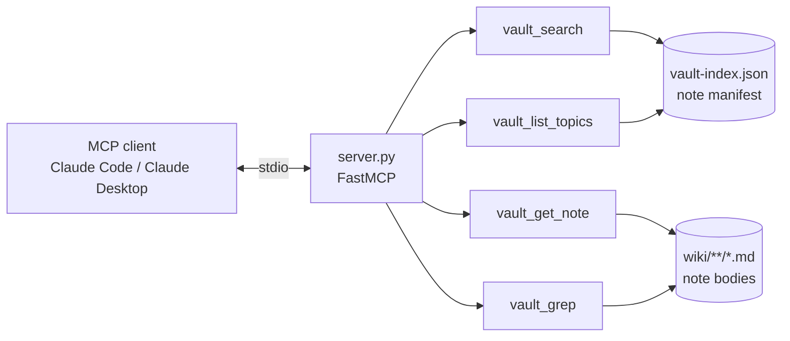

# ai-brain-mcp

[](https://github.com/darkspaz-v1/ai-brain-mcp/actions/workflows/ci.yml)

Read-only MCP server over an Obsidian vault — ranked search, note reading, and full-text grep.

Built so an assistant can answer "have I solved this before?" against a personal knowledge vault
instead of re-deriving the answer or searching the filesystem blindly.

## Install

Requires Python 3.11 or newer (verified on 3.13).

```
git clone https://github.com/darkspaz-v1/ai-brain-mcp.git
cd ai-brain-mcp
python -m venv .venv
.venv\Scripts\activate
pip install -r requirements.txt
python test_server.py
```

`pip install .` also works and installs the same two dependencies (`mcp`, `pydantic`). The server is
started by your MCP client, not by hand; see [Register it](#register-it) below.

For linting (`ruff check .`, as CI does), use `pip install -r requirements-dev.txt` instead.

## Configuration

| Environment variable | Meaning | Default |
|---|---|---|
| `AI_BRAIN_VAULT` | Folder of your Obsidian vault (must contain `vault-index.json` and a `wiki/` folder). | `~/Desktop/AI Brain/AI Brain` |

Set the variable in your MCP client config (below); the default is only a convenience fallback.

## Tools

| Tool | Does |
|---|---|
| `vault_search` | Ranked search across notes, scored on title, tags and body |
| `vault_get_note` | Full text of one note by path |
| `vault_grep` | Literal or regex match across the vault, with file and line |
| `vault_list_topics` | Topic folders and note counts, for orienting before searching |

## Architecture



## The design decision worth stating

**This server is read-only by construction, not by policy.** There is no write path in the code at
all — no create, edit, append or delete tool exists to be called by mistake or talked into running.
A knowledge vault is exactly the kind of store where a confused write is worse than no access, so the
capability is simply absent rather than guarded.

The search tool returns results that point at the next tool to call, so a client can go from a vague
question to the right note without a second round trip.

## Notes

- Regex input is validated, and a bad pattern returns an actionable error rather than a traceback.
- Tests assert on structure and invariants rather than specific note contents.

**21 checks pass.**

## About MCP

[Model Context Protocol](https://modelcontextprotocol.io) is a standard for exposing tools to an LLM
client. This server speaks MCP over stdio, so it is registered in the client config rather than run
directly.

### Register it

Claude Desktop reads `%APPDATA%\Claude\claude_desktop_config.json`:

```json
{
  "mcpServers": {
    "ai-brain": {
      "command": "python",
      "args": ["C:/path/to/ai-brain-mcp/server.py"],
      "env": { "AI_BRAIN_VAULT": "C:/path/to/your/vault" }
    }
  }
}
```

Claude Code equivalent:

```
claude mcp add ai-brain -e AI_BRAIN_VAULT=C:/path/to/your/vault -- python C:/path/to/ai-brain-mcp/server.py
```

Use the Python from the environment where you ran `pip install -r requirements.txt` (for a venv, the full
path to `.venv\Scripts\python.exe`) as `command`.

**Register it twice if you use both Claude Code and Claude Desktop.** They read separate config files,
and a server registered in one is invisible to the other — this cost real debugging time.

## Tests

```
python test_server.py
```

Drives every tool through the real handlers and prints one `PASS` line per check.
The suite builds a small throwaway vault in a temp folder, so it needs no personal vault and
passes on any machine. No pytest — the
suite is a single script so it runs anywhere with no dev dependencies.

## License

MIT — see [LICENSE](LICENSE).
